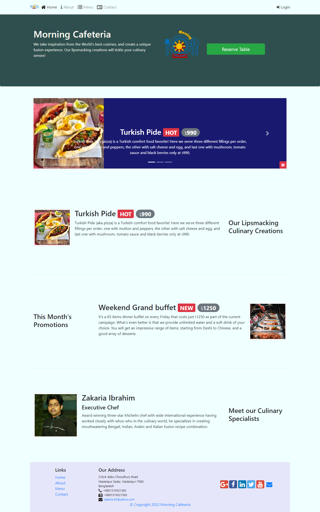

This project is a comprehensive approach to design a responsive website using the most popular front-end UI framework Bootstrap (version 4). Some related packages are also implemented to make this website more effective such as bootstrap-social, font-awesome, node-sass, onchange, parallelshell and so on.
  
Live URL: [morning-cafeteria-bd.netlify.app](https://morning-cafeteria-bd.netlify.app/)
 
  
#Home page - desktop view:
  

  
#Home page - mobile view:
  

  
#Some more pages:
  

  

  

  